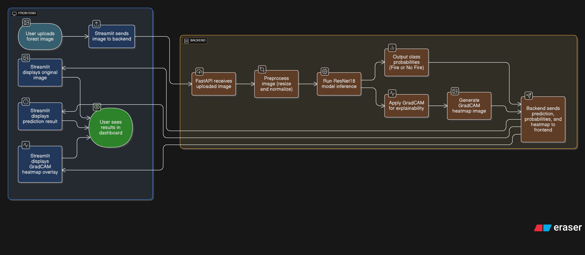
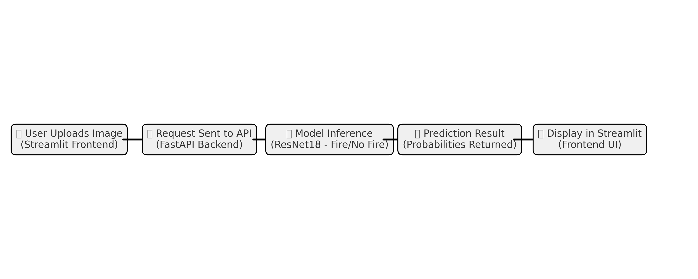
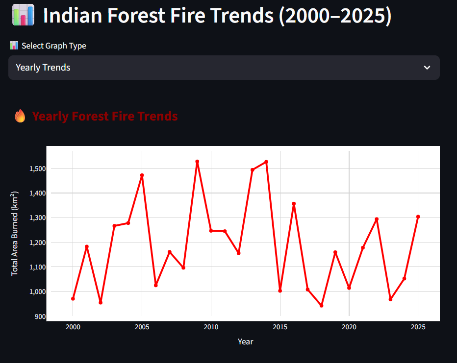
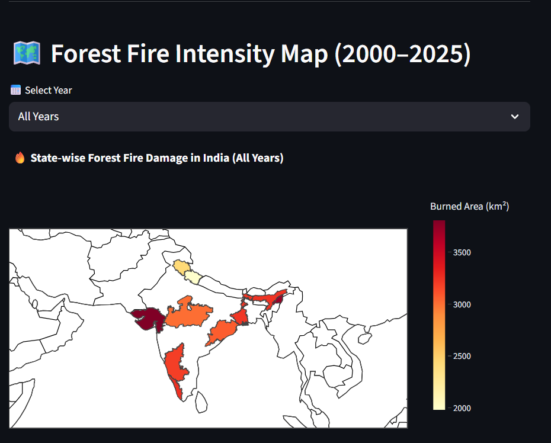

# 🔥 Forest Fire Detection System

An AI-powered **Forest Fire Detection System** that uses **Deep Learning** (ResNet18) to classify images as **Fire** or **No Fire** and visualize the decision process with **Grad-CAM heatmaps**.

The system is built with:

* **Backend** → FastAPI (model inference + heatmap generation)
* **Frontend** → Streamlit (image upload, prediction, visualization)
* **Model** → ResNet18 (trained / ImageNet fallback)

---

# 🚀 Features

✅ Upload forest images and detect if fire is present.

✅ Real-time predictions using a PyTorch ResNet18 model.

✅ Class probabilities (Fire vs No Fire).

✅ Visual explanations with Grad-CAM heatmaps.

✅ Modular architecture with FastAPI backend & Streamlit frontend.

---

## 📂 Project Structure

```
forest-fire-detection/
│── backend/
│   ├── app.py                 # FastAPI backend (inference + heatmaps)
│   ├── train.py               # Training script (ResNet18 fine-tuning)
│   ├── main.py
│   ├── requirements.txt
│   └── __init__.py
│
│── data/                       # Datasets
│   ├── CSV_data/
│   │   └── india_forest_fires_2000_2025.csv
│   │
│   ├── Image_data/
│   │   └── ForestFireDataset/
│   │       └── train/
│   │           ├── fire/
│   │           └── nofire/
│   │
│   └── Maps/
│       ├── Admin2.cnp
│       ├── Admin2.dbf
│       ├── Admin2.prj
│       ├── Admin2.shp
│       ├── Admin2.shx
│       └── india_states.geojson
│
│── frontend/
│   ├── app.py                 # Streamlit frontend (UI)
│   ├── requirements.txt
│   └── __init__.py
│
└── README.md

```

---

## ⚙️ Installation & Setup

### 1️⃣ Clone the repository

```bash
git clone git@github.com:AshrayVB30/Forest-Fire-Detection-System.git
cd forest-fire-detection
```

### 2️⃣ Create a virtual environment

```bash
python -m venv .venv
source .venv/bin/activate   # Linux/Mac
.venv\Scripts\activate      # Windows
```

### 3️⃣ Install dependencies

```bash
pip install -r requirements.txt
```

### 4️⃣ Start the backend (FastAPI)

```bash
cd forest-fire-detection
uvicorn backend.app:app --reload
```

The backend will run at → `http://127.0.0.1:8000`

### 5️⃣ Start the frontend (Streamlit)

```bash
cd frontend
streamlit run app.py
```

The frontend will run at → `http://localhost:8501`

---

## 🧠 Model Training

* Model: **ResNet18**
* Dataset: **Forest Fire Dataset (images in data/Image_data/ForestFireDataset/)**
* Training script: **backend/train.py**
* Output model is saved in **backend/models/fire_detection_resnet18.pth**
---
## Workflow Diagram

()

---

## 📦 Requirements

See `requirements.txt`:

* fastapi
* uvicorn
* streamlit
* torch
* torchvision
* pillow
* matplotlib
* numpy
* opencv-python
* streamlit
* requests
* plotly
* geopandas
* pyogrio
* tqdm

---

## Sample Output

**Forest Fire Detection Output with Heatmap**

()

**Indian Forest Fire Trends (2000–2025)**



**Forest Fire Intensity Map (2000–2025)**



---
⚡ Built with *FastAPI* + *Streamlit* + *PyTorch*